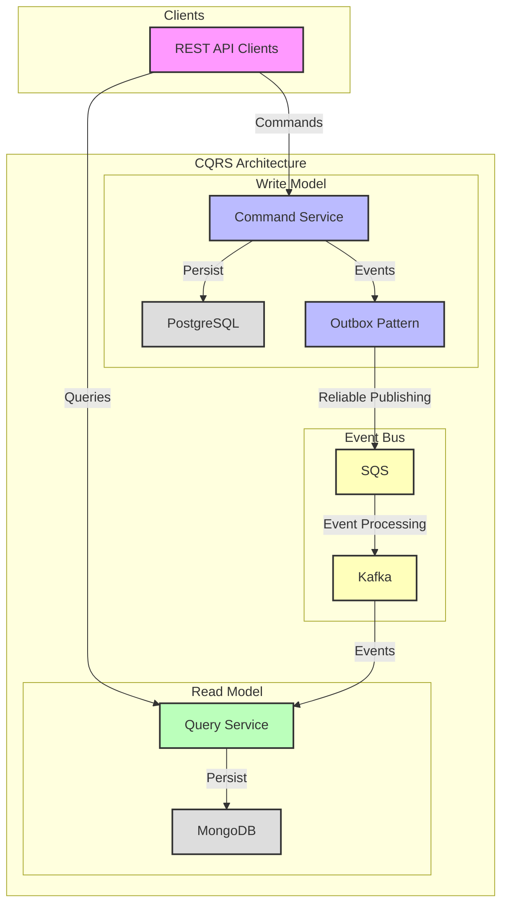
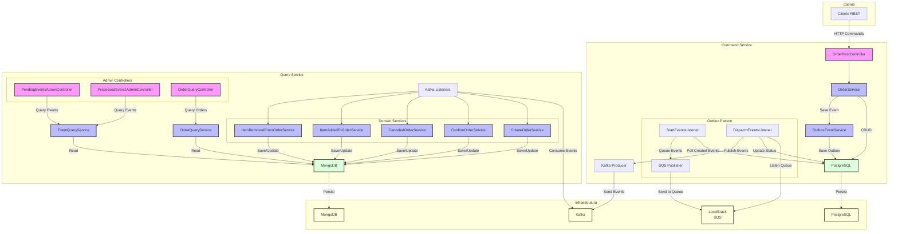

# Simple CQRS - Arquitetura Orientada a Eventos

Este projeto demonstra uma arquitetura moderna baseada em CQRS (Command Query Responsibility Segregation) e Event-Driven, utilizando Spring Boot, Kafka, SQS, PostgreSQL, MongoDB e Docker Compose.

## Visão Arquitetural

O sistema é construído seguindo o padrão CQRS, separando claramente as responsabilidades de escrita (Command) e leitura (Query), conectados por um barramento de eventos:



### Componentes Principais

1. **Write Model (Command)**
   - Responsável por todas as operações de escrita
   - Utiliza PostgreSQL para persistência
   - Implementa Outbox Pattern para publicação confiável de eventos

2. **Event Bus**
   - Kafka como barramento principal de eventos
   - SQS para gerenciamento do Outbox Pattern
   - Garante entrega confiável e ordenada dos eventos

3. **Read Model (Query)**
   - Processa eventos e mantém visão otimizada para leitura
   - Utiliza MongoDB para consultas eficientes
   - Implementa consistência eventual

## Visão Detalhada da Implementação

O diagrama abaixo detalha a implementação técnica dos componentes:



## Padrões e Boas Práticas

### Padrões Arquiteturais

1. **CQRS (Command Query Responsibility Segregation)**
   - Separação clara entre operações de escrita (Command) e leitura (Query)
   - Modelos de dados otimizados para cada tipo de operação
   - Maior escalabilidade e performance para cada contexto

2. **Event-Driven Architecture (EDA)**
   - Comunicação assíncrona baseada em eventos
   - Baixo acoplamento entre serviços
   - Melhor resiliência e escalabilidade
   - Facilita evolução e manutenção do sistema

3. **Outbox Pattern**
   - Garante consistência entre banco de dados e mensagens publicadas
   - Transação atômica para salvar dados e eventos
   - Publicação confiável de eventos
   - Evita problemas de "dual writes"

4. **Database per Service**
   - PostgreSQL para o modelo de escrita (Command)
   - MongoDB para o modelo de leitura (Query)
   - Independência de dados entre serviços
   - Otimização para diferentes padrões de acesso

### Padrões de Domínio

1. **Domain Events**
   - Eventos representam mudanças significativas no domínio
   - Carregam dados relevantes do contexto
   - Permitem rastreabilidade de mudanças
   - Facilitam integrações e extensões

2. **Event Sourcing (Parcial)**
   - Histórico de mudanças via eventos
   - Possibilidade de reconstruir estado
   - Auditoria natural das operações

### Boas Práticas

1. **Idempotência**
   - Processamento seguro de eventos duplicados
   - Verificação de eventos já processados
   - Garantia de consistência

2. **Consistência Eventual**
   - Modelo de leitura atualizado de forma assíncrona
   - Tolerância a latência em troca de escalabilidade
   - Gestão de eventos pendentes

3. **Observabilidade**
   - Logging estruturado

4. **API First**
   - Endpoints REST bem definidos
   - DTOs específicos para cada operação

5. **DevOps Ready**
   - Containerização com Docker
   - Configuração via variáveis de ambiente
   - Scripts de automação
   - Ambiente local completo via Docker Compose

## Como rodar localmente

### Opção 1: Docker Compose (Recomendado para testes)

**Pré-requisitos:**
- Docker e Docker Compose
- Java 21+ (para build local)

**Execução automatizada:**
```bash
# Executa build + docker-compose em uma única operação
./start-local.sh
```

**Execução manual:**
```bash
# 1. Build das aplicações
cd cqrs-command && ./mvnw clean package -DskipTests
cd ../cqrs-query && ./mvnw clean package -DskipTests

# 2. Subir toda a infraestrutura + aplicações
docker-compose up --build
```

### Opção 2: IDE (Para desenvolvimento e debug)

**Pré-requisitos:**
- Java 21+
- IDE de preferência (IntelliJ IDEA, Eclipse, VS Code)

**Passos:**
1. **Suba apenas a infraestrutura:**
   ```bash
   # Comente as linhas dos services cqrs-command e cqrs-query no docker-compose.yml
   docker-compose up -d kafka mongo postgres localstack
   ```

2. **Execute as aplicações via sua IDE:**
   - **Command Service**: Execute `CqrsCommandApplication.java` na porta 8081
   - **Query Service**: Execute `CqrsQueryApplication.java` na porta 8082


### Acesse as UIs:
- Kafka UI: [http://localhost:8080](http://localhost:8080)
- Mongo Express: [http://localhost:8083](http://localhost:8083)

## Exemplos de uso (curl)

### Criar pedido
```bash
curl -X POST http://localhost:8081/orders -H 'Content-Type: application/json' -d '{"customerId":"cliente1"}'
```

### Adicionar item
```bash
curl -X POST http://localhost:8081/orders/{correlationId}/items -H 'Content-Type: application/json' -d '{"productId":1,"quantity":2}'
```

### Confirmar pedido
```bash
curl -X POST http://localhost:8081/orders/{correlationId}/confirm
```

### Cancelar pedido
```bash
curl -X POST http://localhost:8081/orders/{correlationId}/cancel -H 'Content-Type: application/json' -d '{"reason":"Motivo"}'
```

### Consultar pedido (Query)
```bash
curl -X GET http://localhost:8082/orders/{correlationId}
```

### Consultar eventos pendentes/processados
```bash
curl -X GET http://localhost:8082/admin/pending-events/pending
curl -X GET http://localhost:8082/admin/processed-events
```

## Diferenciais do Projeto

- Arquitetura robusta, escalável e resiliente
- Separação clara de responsabilidades (CQRS)
- Consistência eventual e tolerância a falhas
- Código limpo, testável e bem estruturado

---

Consulte os READMEs de cada subprojeto para detalhes específicos de build, configuração e endpoints. 